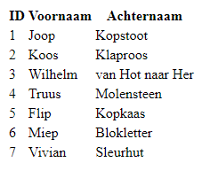
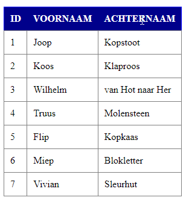

# OOP
## Lessen rondom Basic Object Oriented Programming
  

# Inleiding
De broncode die je hier vindt is bedoeld voor de workshop(s) 'Basic OOP'.  
We bouwen hier in *vanilla PHP* een HTML **TableGenerator**. Middels de TabelGenerator kunnen we b.v. data uit een database halen en op basis van de data automatisch een tabel genereren in een pagina. We hoeven dan zelf geen HTML-code in te tikken.  
Eventueel kunnen we nog extra parameters meegeven, namelijk:
  
* Om de kolomkoppen andere namen te geven
* Om b.v. styling (CSS) aan de tabel mee te geven
  
In de code maken we kennis met de volgende OOP technieken/begrippen:  
  
1. Class
2. Interface
3. Namespace
4. Inheritance
5. Properties
6. Methods
7. Abstraction
8. Factory Design Pattern
9. static
  
# Gebruik
Stel je haalt users binnen uit de database en dit levert de volgende array op:  
  
```php
$data_from_db = [
	[ 'id' => 1, 'firstname' => 'Joop', 'surname' => 'Kopstoot' ],
	[ 'id' => 2, 'firstname' => 'Koos', 'surname' => 'Klaproos' ],
	[ 'id' => 3, 'firstname' => 'Wilhelm', 'surname' => 'van Hot naar Her' ],
	[ 'id' => 4, 'firstname' => 'Truus', 'surname' => 'Molensteen' ],
	[ 'id' => 5, 'firstname' => 'Flip', 'surname' => 'Kopkaas' ],
	[ 'id' => 6, 'firstname' => 'Miep', 'surname' => 'Blokletter' ],
	[ 'id' => 7, 'firstname' => 'Vivian', 'surname' => 'Sleurhut' ]
];
```  
  
## Zonder styling
Deze array geven we door aan een **Factory** genaamd **TableFactory**. Dit is een _static_ class met slechts 1 method, namelijk _**create()**_:
  
```php
public static function create(
    array $data,                // De data. VERPLICHT
    mixed $heading = true,      // Toon kolomkoppen, of array met koppen? OPTIONEEL
    array $attributes = []      // Attributen zoals styling. OPTIONEEL
)
```  
  
De method _**create**_() maakt een boomstructuur van objecten aan. Via een method _**render**_() wordt dan de HTML-code voor de tabel gegenereerd en kan deze als output teruggestuurd worden naar de browser.
Om de boomstructuur te genereren roepen we de method create() in de Factory aan:  
```php
$table = App\Html\Table\TableFactory::create(
	$data_from_db, 						// Data
	['ID', 'Voornaam', 'Achternaam'],	// Kolomkoppen
);
```  
  
We geven nog als extra mee dat we andere kolomkoppen willen.  
  
Vervolgens hoeven we alleen nog maar de render() opdracht, waarover we beschikken in het object in de variabele $table, uit te voeren:  
```php
$table->render();
```  
### Resultaat  
  

  
## Met styling
Wanneer we styling willen toepassen dan breiden we het aantal parameters van de method create() in de Factory uit:  
  
```php
$table = App\Html\Table\TableFactory::create(
	$data_from_db, 						// Data
	['ID', 'Voornaam', 'Achternaam'],	// Kolomkoppen
	[									// Array met tag attributen
		'table' => [
			'style' => 'border-collapse: collapse; border: 1px solid blue;'
		],
		'td' => [
			'style' => 'padding: 10px; border: 1px solid grey; text-align: left;'
		],
		'th' => [
			'style' => 'padding: 10px; text-align: left; background-color: darkblue; color: white; text-transform: uppercase;'
		]
	]
);
```
  
### Resultaat
          


### CSS Classes
Je kunt ook CSS classes toevoegen uiteraard. Voorbeeld is dat we de koppen rood willen, dan zou de code er als volgt uitzien (mits we de CSS class hebben gedefinieerd in een stylesheet uiteraard):  
  
#### CSS
```css
    .text-red {
		color: red;
	}
```  
  
#### PHP
```php
    'th' => [
        'style' => 'padding: 10px; text-align: left; text-transform: uppercase;',
        'class' => 'text-red'
    ]
```


*Copyright (c) 2019 by J.J. Strootman*